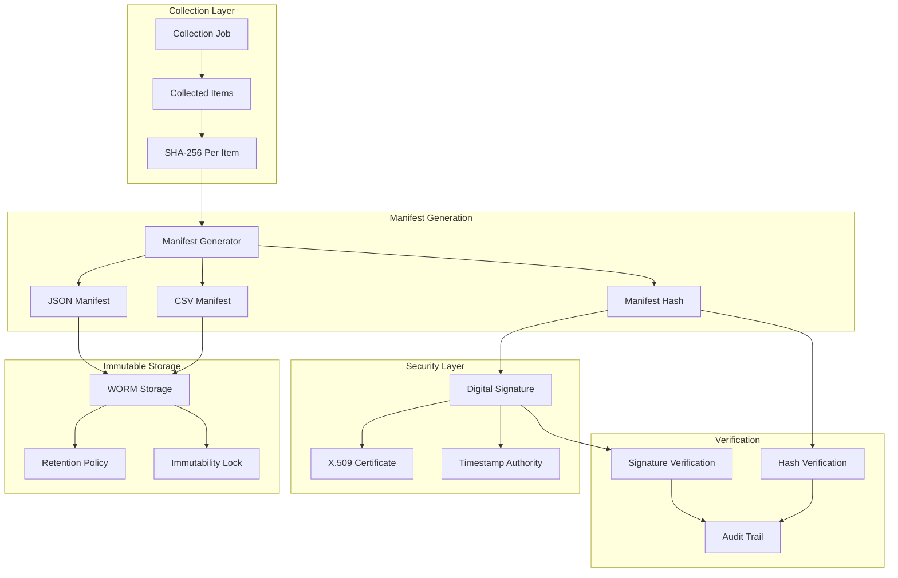

# Chain of Custody Hardening Implementation - v2.1

## Overview

The Hybrid eDiscovery Collector now includes comprehensive chain-of-custody hardening with tamper-evident manifests, digital signatures, and Write-Once-Read-Many (WORM) compliant storage. This implementation ensures evidence integrity and provides cryptographic proof of data authenticity for legal proceedings.

## Architecture

### Components



## Database Schema

### New Tables

```sql
-- JobManifest table for manifest metadata
CREATE TABLE JobManifests (
    Id INTEGER PRIMARY KEY AUTOINCREMENT,
    JobId INTEGER NOT NULL,
    ManifestId TEXT(36) NOT NULL UNIQUE,
    Format INTEGER NOT NULL, -- JSON=1, CSV=2, Both=3
    CreatedDate DATETIME NOT NULL,
    FinalizedDate DATETIME NOT NULL,
    ManifestHash TEXT(64) NOT NULL,
    DigitalSignature TEXT(4000),
    FilePath TEXT(500) NOT NULL,
    ImmutableStoragePath TEXT(500) NOT NULL,
    TotalItems INTEGER NOT NULL,
    TotalSizeBytes INTEGER NOT NULL,
    SuccessfulItems INTEGER NOT NULL,
    FailedItems INTEGER NOT NULL,
    ImmutablePolicyId TEXT(64),
    IsSealed BOOLEAN NOT NULL DEFAULT 0,
    CreatedByCorrelationId TEXT(36) NOT NULL,
    CreatedByWorker TEXT(100) NOT NULL,
    FOREIGN KEY (JobId) REFERENCES CollectionJobs(Id) ON DELETE CASCADE
);

-- ManifestVerification table for integrity checks
CREATE TABLE ManifestVerifications (
    Id INTEGER PRIMARY KEY AUTOINCREMENT,
    ManifestId INTEGER NOT NULL,
    VerificationDate DATETIME NOT NULL,
    Type INTEGER NOT NULL, -- HashVerification=1, SignatureVerification=2, etc.
    Result INTEGER NOT NULL, -- Valid=1, Invalid=2, Inconclusive=3, Error=4
    ComputedHash TEXT(64),
    ExpectedHash TEXT(64),
    SignatureValid BOOLEAN NOT NULL,
    ErrorDetails TEXT(1000),
    VerificationId TEXT(36) NOT NULL UNIQUE,
    CorrelationId TEXT(36) NOT NULL,
    VerifiedBy TEXT(100) NOT NULL,
    FOREIGN KEY (ManifestId) REFERENCES JobManifests(Id) ON DELETE CASCADE
);
```

## Configuration

### appsettings.json

```json
{
  "ChainOfCustody": {
    "ManifestFormat": "Both",
    "ManifestStoragePath": "./manifests",
    "ImmutableStoragePath": "./immutable",
    "EnableDigitalSigning": false,
    "SigningCertificateThumbprint": null,
    "EnableWormStorage": true,
    "ImmutablePolicyId": "ediscovery-worm-policy",
    "ManifestRetentionDays": 2555,
    "EnablePeriodicVerification": true,
    "VerificationIntervalHours": 24
  }
}
```

### Environment-Specific Settings

| Environment | Digital Signing | WORM Storage | Verification Interval |
| ----------- | --------------- | ------------ | --------------------- |
| Development | Disabled        | Enabled      | 24 hours              |
| Staging     | Optional        | Enabled      | 12 hours              |
| Production  | **Required**    | **Required** | 6 hours               |

## Manifest Structure

### JSON Manifest Example

```json
{
  "manifestId": "a1b2c3d4-e5f6-7890-abcd-ef1234567890",
  "jobId": 42,
  "matterId": 10,
  "custodian": "john.doe@company.com",
  "jobType": "Email",
  "collectionRoute": "GraphApi",
  "startTime": "2025-10-05T08:00:00Z",
  "endTime": "2025-10-05T09:30:00Z",
  "createdDate": "2025-10-05T09:30:15Z",
  "finalizedDate": "2025-10-05T09:30:30Z",
  "totalItems": 1247,
  "successfulItems": 1245,
  "failedItems": 2,
  "totalSizeBytes": 45678901,
  "estimatedSizeBytes": 50000000,
  "createdByWorker": "EDISCOVERY-WORKER-01",
  "correlationId": "corr-12345678-90ab-cdef-1234-567890abcdef",
  "items": [
    {
      "itemId": "email-123456789",
      "itemType": "Email",
      "subject": "Quarterly Financial Report",
      "from": "finance@company.com",
      "to": "john.doe@company.com; jane.smith@company.com",
      "itemDate": "2025-10-04T14:30:00Z",
      "collectedDate": "2025-10-05T08:15:30Z",
      "sizeBytes": 2456789,
      "sha256Hash": "a1b2c3d4e5f6789012345678901234567890abcdef1234567890abcdef123456",
      "filePath": "./output/email-123456789.eml",
      "isSuccessful": true,
      "errorMessage": null,
      "collectionSequence": 1,
      "custodian": "john.doe@company.com",
      "correlationId": "item-corr-12345678"
    }
  ],
  "integrity": {
    "hashAlgorithm": "SHA-256",
    "manifestHash": "manifest-hash-567890abcdef1234567890abcdef1234567890abc",
    "itemsHash": "items-hash-234567890abcdef1234567890abcdef1234567890a",
    "signatureAlgorithm": "RSA-SHA256",
    "digitalSignature": "base64-encoded-signature...",
    "signingCertificateThumbprint": "cert-thumbprint-123456789",
    "timestampAuthority": "timestamp.authority.com",
    "immutablePolicyId": "ediscovery-worm-policy",
    "wormCompliant": true
  }
}
```

### CSV Manifest Example

```csv
Type,ManifestId,JobId,MatterId,Custodian,JobType,Route,StartTime,EndTime,TotalItems,SuccessfulItems,FailedItems,TotalSizeBytes,ManifestHash,CreatedDate
MANIFEST_HEADER,a1b2c3d4-e5f6-7890-abcd-ef1234567890,42,10,john.doe@company.com,Email,GraphApi,2025-10-05T08:00:00Z,2025-10-05T09:30:00Z,1247,1245,2,45678901,manifest-hash-567890abcdef,2025-10-05T09:30:15Z
ITEM,email-123456789,Email,Quarterly Financial Report,finance@company.com,"john.doe@company.com; jane.smith@company.com",2025-10-04T14:30:00Z,2025-10-05T08:15:30Z,2456789,a1b2c3d4e5f6789012345678901234567890abcdef1234567890abcdef123456,./output/email-123456789.eml,True,,1
```

## API Endpoints

### Generate Manifest

```http
POST /api/chainofcustody/manifest/generate/42
```

**Response:**

```json
{
  "id": 15,
  "jobId": 42,
  "manifestId": "a1b2c3d4-e5f6-7890-abcd-ef1234567890",
  "format": "Both",
  "createdDate": "2025-10-05T09:30:15Z",
  "manifestHash": "manifest-hash-567890abcdef",
  "filePath": "./manifests/manifests/2025-10-05/manifest_a1b2c3d4_000042_20251005_093015.json",
  "totalItems": 1247,
  "isSealed": false
}
```

### Seal Manifest

```http
POST /api/chainofcustody/manifest/seal/15
```

**Response:**

```json
{
  "message": "Manifest sealed successfully",
  "manifestId": 15
}
```

### Verify Manifest

```http
POST /api/chainofcustody/manifest/verify/15
```

**Response:**

```json
{
  "id": 23,
  "manifestId": 15,
  "verificationDate": "2025-10-05T10:00:00Z",
  "type": "HashVerification",
  "result": "Valid",
  "signatureValid": true,
  "verificationId": "ver-12345678-90ab-cdef",
  "correlationId": "corr-verification-123",
  "verifiedBy": "EDISCOVERY-WORKER-01"
}
```

### Download Manifest

```http
GET /api/chainofcustody/manifest/15/download?format=json
```

Returns the manifest file for download.

### Chain of Custody Summary

```http
GET /api/chainofcustody/matter/10/summary
```

**Response:**

```json
{
  "matterId": 10,
  "totalJobs": 5,
  "jobsWithManifests": 5,
  "sealedManifests": 4,
  "totalItems": 15247,
  "totalSizeBytes": 5678901234,
  "jobs": [
    {
      "jobId": 42,
      "custodian": "john.doe@company.com",
      "status": "Completed",
      "totalItems": 1247,
      "hasManifest": true,
      "manifestSealed": true,
      "lastVerified": "2025-10-05T10:00:00Z"
    }
  ]
}
```

## Security Features

### Digital Signatures

When enabled, manifests are signed using X.509 certificates:

1. **Certificate Requirements:**

   - RSA-2048 or higher
   - Code signing or document signing capability
   - Valid chain to trusted root
   - Not expired or revoked

2. **Signature Process:**
   - Manifest content hashed with SHA-256
   - Hash signed with certificate private key
   - Signature stored as Base64 in manifest
   - Certificate thumbprint recorded for verification

### WORM Compliance

Write-Once-Read-Many storage ensures tamper-evidence:

1. **File-Level Protection:**

   - Files marked read-only after writing
   - Stored in immutable directory structure
   - Duplicate copies for redundancy

2. **Policy Enforcement:**
   - Retention policies prevent deletion
   - Access logs for all read operations
   - Periodic integrity verification

## Compliance Logging

All chain-of-custody operations are logged with full audit trails:

```
[2025-10-05 09:30:15.123 UTC] AUDIT: ManifestGenerated | JobId: 42 | ManifestId: a1b2c3d4-e5f6-7890-abcd-ef1234567890 | TotalItems: 1247 | Hash: manifest-hash-567890abcdef | CorrelationId: corr-12345678-90ab-cdef-1234-567890abcdef
[2025-10-05 09:30:30.456 UTC] AUDIT: ManifestSealed | ManifestId: 15 | DigitalSignature: true | ImmutableStorage: true | CorrelationId: corr-12345678-90ab-cdef-1234-567890abcdef
[2025-10-05 10:00:00.789 UTC] AUDIT: ManifestVerified | ManifestId: 15 | Result: Valid | SignatureValid: true | CorrelationId: corr-verification-123
```

## Verification Process

### Automated Verification

1. **Hash Verification:**

   - Recalculate manifest content hash
   - Compare with stored hash
   - Verify item-level SHA-256 hashes

2. **Signature Verification:**

   - Validate certificate chain
   - Verify signature against manifest hash
   - Check certificate revocation status

3. **WORM Verification:**
   - Confirm file immutability
   - Verify retention policy compliance
   - Check for unauthorized access

### Manual Verification

For forensic analysis and legal proceedings:

```bash
# Verify manifest hash
sha256sum manifest_a1b2c3d4_000042_20251005_093015.json

# Verify digital signature (with OpenSSL)
openssl dgst -sha256 -verify public_key.pem -signature signature.bin manifest.json

# Check WORM compliance
ls -la /immutable/worm/2025-10-05/
```

## Performance Impact

| Operation           | Average Time               | Resource Usage           |
| ------------------- | -------------------------- | ------------------------ |
| Manifest Generation | 2-5 seconds per 1000 items | CPU: Medium, Memory: Low |
| Digital Signing     | 50-200ms per manifest      | CPU: High, Memory: Low   |
| WORM Storage        | 10-50ms per file           | Disk I/O: Medium         |
| Hash Verification   | 1-3 seconds per manifest   | CPU: Medium, Memory: Low |

## Storage Requirements

| Component            | Storage per Job (1000 items) |
| -------------------- | ---------------------------- |
| JSON Manifest        | 250-500 KB                   |
| CSV Manifest         | 150-300 KB                   |
| Immutable Copies     | 400-800 KB                   |
| Verification Records | 5-10 KB                      |
| **Total Overhead**   | **~1-2 MB**                  |

## Legal Compliance

### Federal Rules of Evidence

- **Rule 901:** Authentication requirements met through cryptographic signatures
- **Rule 902:** Self-authenticating documents via digital certificates
- **Rule 1001:** Original document integrity maintained through hashing

### Industry Standards

- **NIST SP 800-57:** Cryptographic key management compliance
- **ISO 27001:** Information security management alignment
- **FRCP 26(f):** Meet-and-confer preservation requirements

## Implementation Status

✅ **Completed Features:**

- Tamper-evident manifest generation (JSON/CSV)
- SHA-256 integrity hashing
- Digital signature capability
- WORM-compliant storage
- Comprehensive audit logging
- REST API for all operations
- Automated verification system

🔄 **Future Enhancements:**

- Integration with cloud WORM storage (Azure Immutable Blobs, AWS S3 Object Lock)
- Blockchain anchoring for additional tamper-evidence
- Hardware Security Module (HSM) integration
- Automated compliance reporting
- Long-term digital preservation (OAIS model)

The chain-of-custody hardening system provides enterprise-grade evidence integrity suitable for high-stakes litigation and regulatory compliance requirements.
