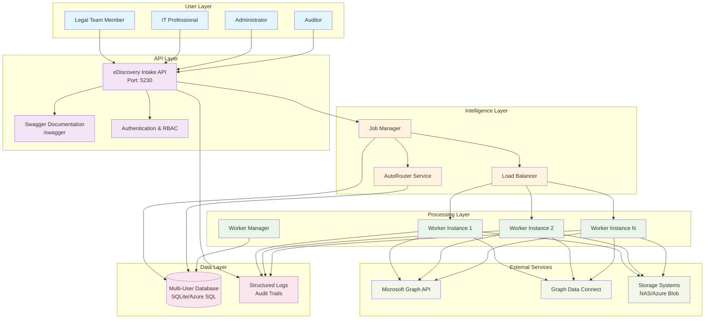
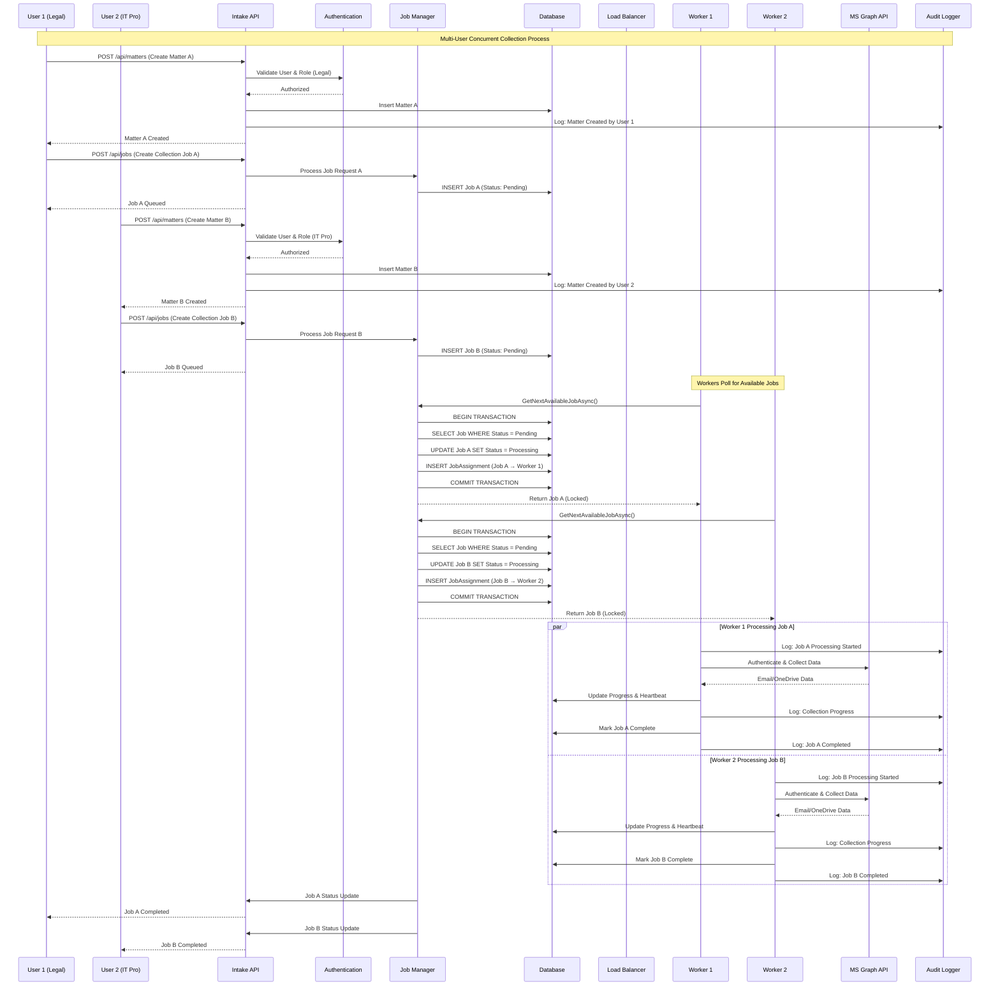
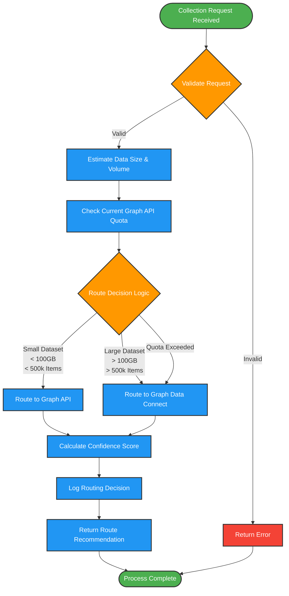
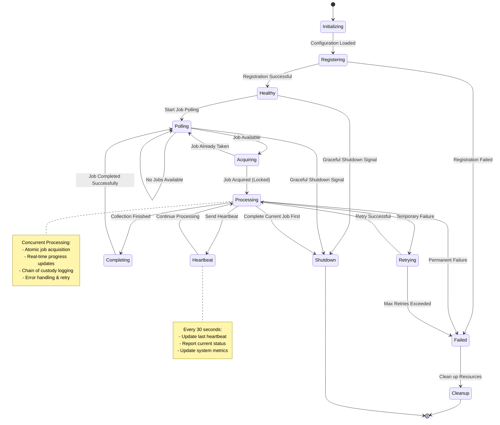
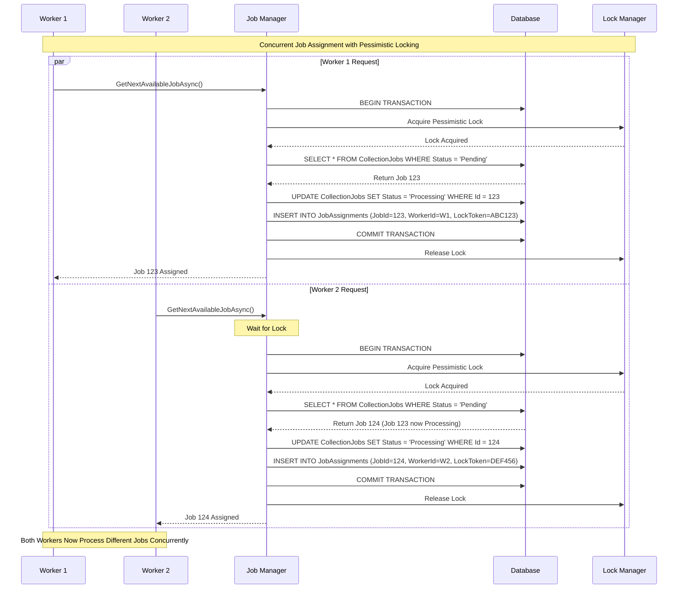
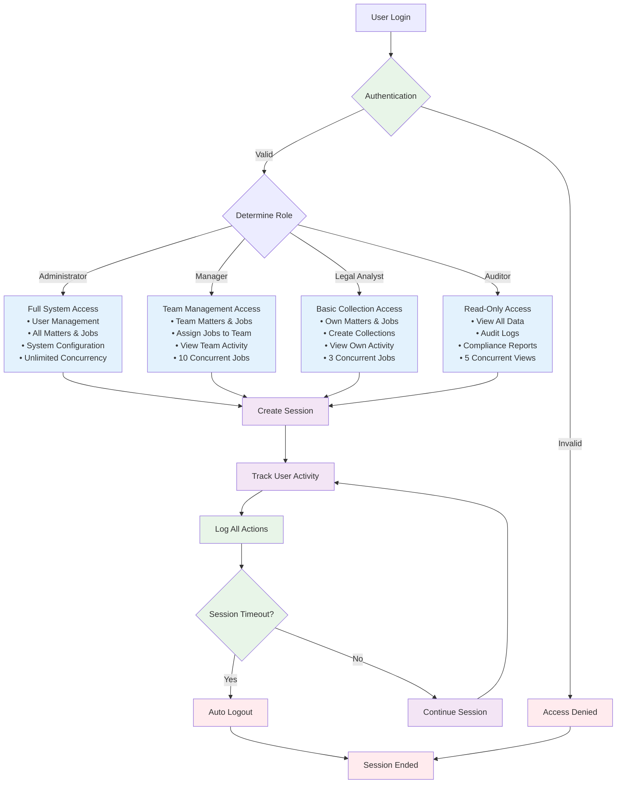
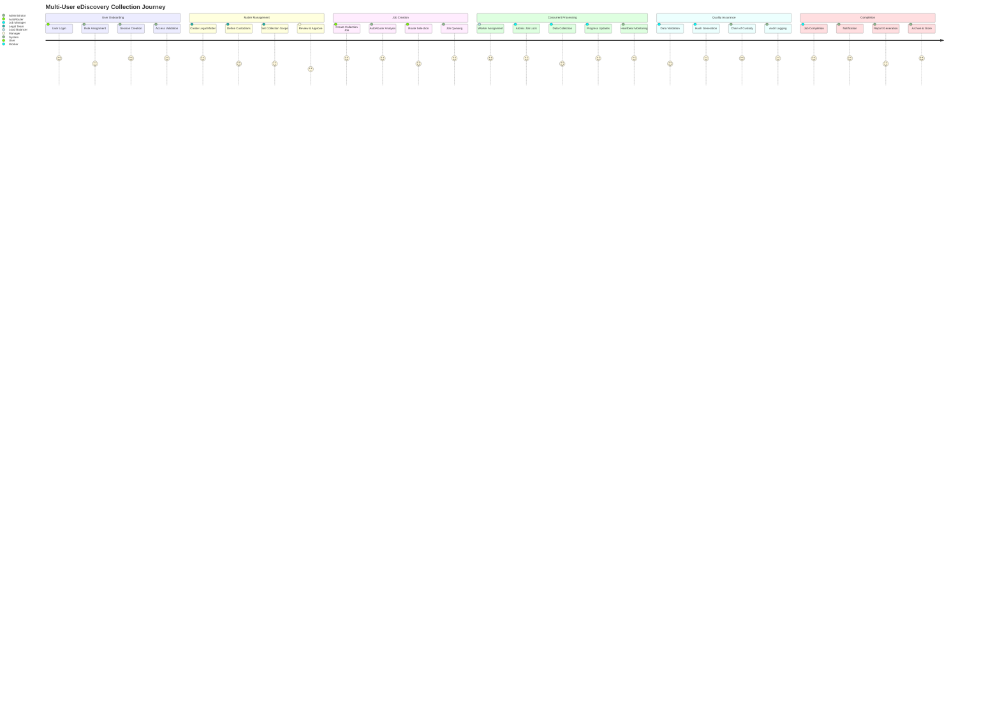
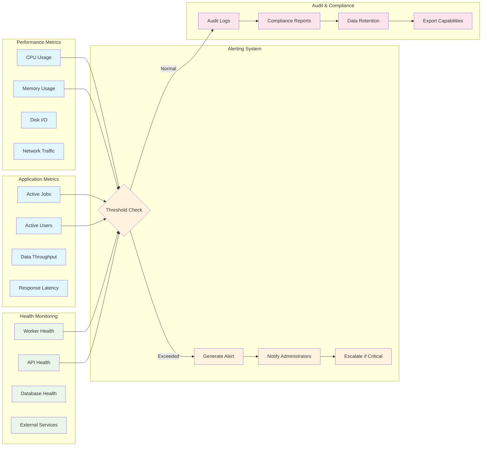
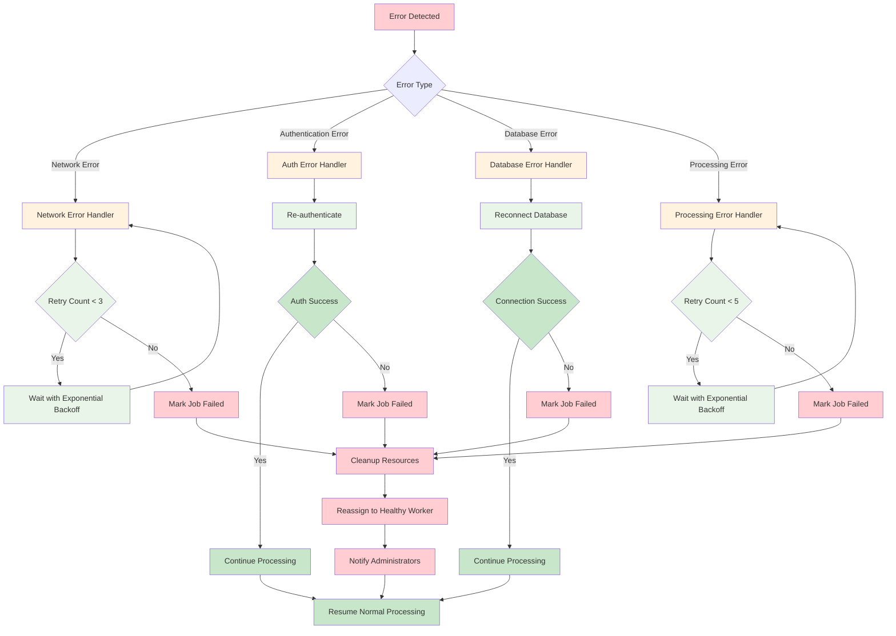

# Hybrid eDiscovery Collector - Process Flow Diagram

**Project:** Hybrid Microsoft 365 eDiscovery Collection System  
**Date:** October 4, 2025  
**Version:** 2.0 - Multi-User Concurrent Processing

---

## 1. High-Level System Architecture Flow

---

## 2. Detailed Multi-User Concurrent Processing Flow

---

## 3. AutoRouter Decision Process Flow

---

## 4. Worker Instance Lifecycle Flow

---

## 5. Database Transaction Flow for Concurrent Job Assignment

---

## 6. User Role-Based Access Control Flow

---

## 7. End-to-End Collection Process Flow

---

## 8. System Performance & Monitoring Flow

---

## 9. Error Handling & Recovery Flow

---

## Summary

This comprehensive process flow diagram illustrates the complete hybrid eDiscovery collector system with multi-user concurrent processing capabilities. The diagrams show:

1. **High-level system architecture** with all components and their interactions
2. **Detailed multi-user concurrent processing** with atomic job assignment
3. **AutoRouter decision logic** for intelligent routing between Graph API and GDC
4. **Worker lifecycle management** with health monitoring and load balancing
5. **Database transaction flows** ensuring data consistency in concurrent operations
6. **Role-based access control** with security and session management
7. **End-to-end user journey** from login to job completion
8. **Performance monitoring** and alerting systems
9. **Error handling and recovery** mechanisms for system resilience

The system successfully implements enterprise-grade multi-user concurrent processing with proper job coordination, security isolation, and comprehensive audit trails as requested in your original requirement to "handle many users can run this tool and process at the same time."
