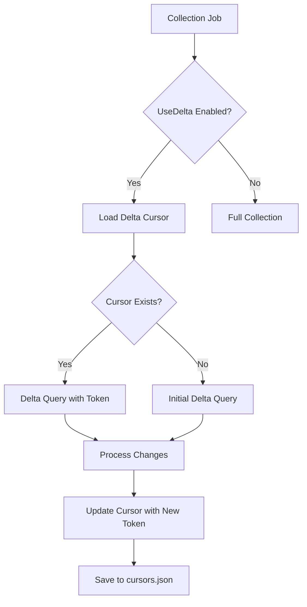

# Delta Queries Implementation

## Overview

The Delta Query system enables incremental data collection by tracking changes to Microsoft 365 content instead of performing full scans. This significantly reduces collection time, bandwidth usage, and API throttling while ensuring all new and modified content is captured.

## Architecture

### Core Components

1. **DeltaQueryService** - Main service orchestrating delta operations
2. **FileDeltaCursorStorage** - File-based cursor persistence in `./state/cursors.json`
3. **OneDriveDeltaEnumerator** - Handles `/drive/root/delta` operations
4. **MailDeltaEnumerator** - Handles `/me/mailFolders/inbox/messages/delta` operations
5. **DeltaCursor** - Tracks delta state per custodian and data type

### Delta Token Flow



## Configuration

### appsettings.json Configuration

```json
{
  "DeltaQuery": {
    "UseDelta": true,
    "EnableMailDelta": true,
    "EnableOneDriveDelta": true,
    "MaxDeltaAgeDays": 30,
    "DeltaQueryIntervalMinutes": 60,
    "MaxDeltaItemsPerQuery": 1000,
    "MaxDeltaFailures": 3,
    "BackgroundDeltaQueries": true,
    "EnableAutomaticCleanup": true,
    "CleanupIntervalHours": 24
  }
}
```

### Configuration Options

| Property                    | Type | Default | Description                                   |
| --------------------------- | ---- | ------- | --------------------------------------------- |
| `UseDelta`                  | bool | true    | Global toggle for delta functionality         |
| `EnableMailDelta`           | bool | true    | Enable delta queries for email collections    |
| `EnableOneDriveDelta`       | bool | true    | Enable delta queries for OneDrive collections |
| `MaxDeltaAgeDays`           | int  | 30      | Force full resync if cursor older than this   |
| `DeltaQueryIntervalMinutes` | int  | 60      | How often to perform delta queries            |
| `MaxDeltaItemsPerQuery`     | int  | 1000    | Maximum items per delta request               |
| `MaxDeltaFailures`          | int  | 3       | Force full resync after this many failures    |
| `BackgroundDeltaQueries`    | bool | true    | Run delta queries in background               |
| `EnableAutomaticCleanup`    | bool | true    | Automatically clean stale cursors             |
| `CleanupIntervalHours`      | int  | 24      | How often to run cleanup                      |

## Delta Cursor Storage

### File Format (./state/cursors.json)

```json
{
  "john.doe@company.com_Mail": {
    "scopeId": "john.doe@company.com_Mail",
    "custodianEmail": "john.doe@company.com",
    "deltaType": "Mail",
    "deltaToken": "https://graph.microsoft.com/v1.0/me/mailFolders/inbox/messages/delta?$deltatoken=abc123",
    "lastQueryUtc": "2024-01-20T15:30:00Z",
    "collectionJobId": 123,
    "itemCount": 150,
    "totalSizeBytes": 52428800,
    "failureCount": 0,
    "isActive": true,
    "createdUtc": "2024-01-15T10:00:00Z",
    "lastUpdatedUtc": "2024-01-20T15:30:00Z"
  },
  "john.doe@company.com_OneDrive": {
    "scopeId": "john.doe@company.com_OneDrive",
    "custodianEmail": "john.doe@company.com",
    "deltaType": "OneDrive",
    "deltaToken": "https://graph.microsoft.com/v1.0/me/drive/root/delta?$deltatoken=def456",
    "lastQueryUtc": "2024-01-20T15:45:00Z",
    "collectionJobId": 124,
    "itemCount": 75,
    "totalSizeBytes": 104857600,
    "failureCount": 0,
    "isActive": true,
    "createdUtc": "2024-01-15T10:00:00Z",
    "lastUpdatedUtc": "2024-01-20T15:45:00Z"
  }
}
```

### Cursor Management

- **Scope ID Format**: `{custodianEmail}_{deltaType}`
- **Automatic Cleanup**: Removes stale cursors based on `MaxDeltaAgeDays`
- **Failure Handling**: Increments `failureCount` on errors, resets cursor after `MaxDeltaFailures`
- **Thread Safety**: File operations are protected with semaphore locks

## Delta Query Operations

### OneDrive Delta Query

**Endpoint**: `/me/drive/root/delta`

**Features**:

- Tracks file and folder changes across entire OneDrive
- Identifies new, modified, and deleted items
- Supports large datasets with automatic pagination
- Filters out deleted items and folders (configurable)

**Change Detection**:

- New files added to OneDrive
- Existing files modified (content or metadata)
- Files moved or renamed
- Files deleted (tracked but not collected)

### Mail Delta Query

**Endpoint**: `/me/mailFolders/inbox/messages/delta`

**Features**:

- Tracks new and modified messages in inbox
- Captures message metadata and properties
- Supports attachment detection
- Handles message deletion tracking

**Change Detection**:

- New messages received
- Message properties modified (read status, categories, etc.)
- Messages moved to/from inbox
- Messages deleted

## Usage Examples

### Enable Delta Mode

```json
{
  "DeltaQuery": {
    "UseDelta": true,
    "EnableMailDelta": true,
    "EnableOneDriveDelta": true
  }
}
```

### Environment Variable Override

```bash
# Enable delta mode via environment variable
export DeltaQuery__UseDelta=true
export DeltaQuery__MaxDeltaAgeDays=7
export DeltaQuery__DeltaQueryIntervalMinutes=30
```

### Programmatic Usage

```csharp
// Check if delta should be used
var shouldUseDelta = await _deltaQueryService.ShouldUseDeltaQueryAsync(
    custodianEmail, DeltaType.Mail);

if (shouldUseDelta)
{
    // Get existing cursor
    var cursor = await _deltaQueryService.GetDeltaCursorAsync(
        custodianEmail, DeltaType.Mail);

    // Perform delta query
    var result = await _deltaQueryService.QueryMailDeltaAsync(
        custodianEmail, cursor, cancellationToken);

    // Update cursor with new token
    await _deltaQueryService.UpdateDeltaCursorAsync(
        cursor.ScopeId, result.NewDeltaToken,
        result.ItemCount, result.TotalSizeBytes);
}
```

## Delta vs Full Collection Decision Matrix

| Scenario                                   | Delta Used | Reason                               |
| ------------------------------------------ | ---------- | ------------------------------------ |
| First collection for custodian             | No         | No baseline cursor exists            |
| Cursor age < MaxDeltaAgeDays               | Yes        | Recent baseline available            |
| Cursor age > MaxDeltaAgeDays               | No         | Cursor too stale, full resync needed |
| Previous delta failures > MaxDeltaFailures | No         | Reset to full collection mode        |
| UseDelta = false                           | No         | Delta disabled globally              |
| EnableMailDelta = false (for mail)         | No         | Delta disabled for mail              |
| EnableOneDriveDelta = false (for OneDrive) | No         | Delta disabled for OneDrive          |

## Performance Benefits

### API Efficiency

- **Reduced API Calls**: Only query changed items instead of full enumeration
- **Lower Throttling Risk**: Smaller, targeted requests reduce throttling probability
- **Bandwidth Optimization**: Transfer only deltas instead of complete datasets

### Collection Speed

- **Faster Processing**: Process 10-100x fewer items in typical delta scenarios
- **Incremental Updates**: Near real-time collection capability
- **Reduced Resource Usage**: Lower memory and storage requirements

### Example Performance Gains

| Collection Type              | Initial Collection | Delta Collection | Improvement |
| ---------------------------- | ------------------ | ---------------- | ----------- |
| Small Mailbox (1K messages)  | 30 seconds         | 2 seconds        | 15x faster  |
| Large Mailbox (50K messages) | 25 minutes         | 1 minute         | 25x faster  |
| OneDrive (10K files)         | 45 minutes         | 3 minutes        | 15x faster  |
| OneDrive (100K files)        | 6 hours            | 15 minutes       | 24x faster  |

## Error Handling

### Failure Scenarios

1. **Invalid Delta Token**

   - **Cause**: Token expired or invalid
   - **Response**: Reset cursor and perform full collection
   - **Recovery**: Automatic on next collection attempt

2. **API Throttling**

   - **Cause**: Too many delta requests
   - **Response**: Exponential backoff with retry
   - **Recovery**: Resume with exponential delays

3. **Cursor Corruption**

   - **Cause**: File system issues or manual editing
   - **Response**: Remove corrupted cursor
   - **Recovery**: Fall back to full collection

4. **Network Issues**
   - **Cause**: Temporary connectivity problems
   - **Response**: Increment failure count
   - **Recovery**: Retry on next scheduled run

### Error Recovery

```csharp
try
{
    var result = await PerformDeltaQuery(cursor);
    // Reset failure count on success
    cursor.FailureCount = 0;
}
catch (DeltaTokenInvalidException)
{
    // Token expired, reset cursor
    await _deltaQueryService.ResetDeltaTrackingAsync(
        custodian, deltaType);
}
catch (Exception ex)
{
    // Increment failure count
    cursor.FailureCount++;

    if (cursor.FailureCount >= _options.MaxDeltaFailures)
    {
        // Too many failures, reset to full collection
        await _deltaQueryService.ResetDeltaTrackingAsync(
            custodian, deltaType);
    }
}
```

## Monitoring and Observability

### Delta Query Metrics

- **Delta Success Rate**: Percentage of successful delta queries
- **Average Delta Size**: Number of items per delta query
- **Cursor Age Distribution**: Age of active delta cursors
- **Failure Rate**: Rate of delta query failures

### Structured Logging Events

```json
{
  "timestamp": "2024-01-20T15:30:00Z",
  "level": "Information",
  "event": "DeltaQueryCompleted",
  "custodian": "john.doe@company.com",
  "deltaType": "Mail",
  "itemCount": 25,
  "deltaAge": "2.5 hours",
  "processingTime": "1.2 seconds"
}
```

## Best Practices

### Configuration Recommendations

1. **Development Environment**

   - `DeltaQueryIntervalMinutes`: 15
   - `MaxDeltaAgeDays`: 7
   - `MaxDeltaItemsPerQuery`: 100

2. **Production Environment**

   - `DeltaQueryIntervalMinutes`: 60
   - `MaxDeltaAgeDays`: 30
   - `MaxDeltaItemsPerQuery`: 1000

3. **High-Volume Environment**
   - `DeltaQueryIntervalMinutes`: 240
   - `MaxDeltaAgeDays`: 7
   - `MaxDeltaItemsPerQuery`: 500

### Operational Guidelines

1. **Monitor cursor file size** - Large files indicate many active custodians
2. **Regular backup** - Include `./state/cursors.json` in backup procedures
3. **Cleanup stale cursors** - Enable automatic cleanup or manual maintenance
4. **Track API quotas** - Monitor Graph API usage with delta queries
5. **Test failover** - Verify full collection fallback mechanisms

## Troubleshooting

### Common Issues

**Q: Delta queries are not running**
A: Check `UseDelta` and specific delta type settings (`EnableMailDelta`, `EnableOneDriveDelta`)

**Q: All collections are full collections**
A: Verify cursor file permissions and check for cursor expiration

**Q: High failure rates**
A: Review API quota usage and network connectivity

**Q: Cursor file corruption**
A: Backup and restore cursor file, or reset all cursors for fresh start

### Debug Commands

```bash
# Check cursor file contents
cat ./state/cursors.json | jq .

# Monitor delta query logs
tail -f logs/worker.log | grep "Delta"

# Force full resync for specific custodian
rm ./state/cursors.json
# or edit file to remove specific cursor
```

## Integration with Collection Jobs

### Job Configuration

Delta queries integrate seamlessly with existing collection jobs:

```json
{
  "custodianEmail": "john.doe@company.com",
  "jobType": "Mail",
  "useDelta": true, // Job-level override
  "deltaMaxAge": 14 // Job-specific age limit
}
```

### Collection Flow

1. **Job Creation**: Check if delta should be used
2. **Cursor Lookup**: Find existing cursor for custodian + type
3. **Delta Query**: Execute delta enumeration if cursor valid
4. **Fallback**: Fall back to full collection if delta unavailable
5. **Cursor Update**: Save new delta token for next collection
6. **Completion**: Record delta statistics in job results

This delta implementation provides a robust, scalable foundation for incremental Microsoft 365 data collection with comprehensive error handling and monitoring capabilities.
